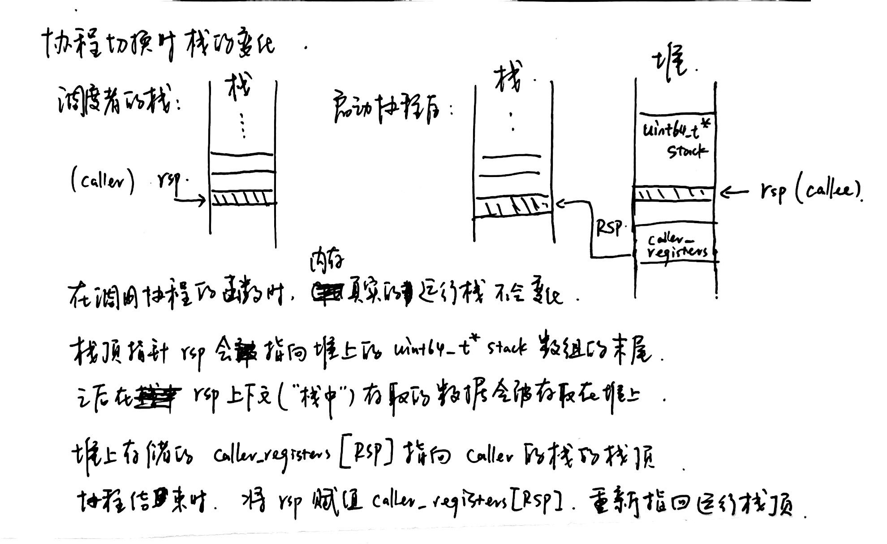
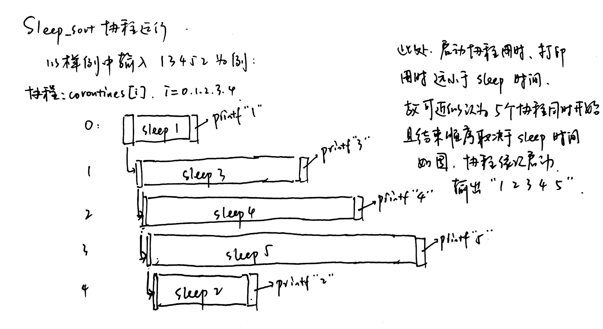

# 协程实验
> 张驰 2022010754 zhang-ch22@mails.tsinghua.edu.cn

## Task1
**1. 添加的代码**
`context.h`:
```cpp
// virtual void resume()
coroutine_switch(caller_registers, callee_registers); // 把当前的寄存器状态保存到caller_registers中，然后切换到callee_registers的运行状态。即存下调用者的当前状态，然后启动协程。
```

`coroutine_pool.h`:
```cpp
// void serial_execute_all()
while(true){ // 不断循环直到所有协程全都结束
    int finish_num=0; // 记录本次循环结束的协程的数量
    for(context_id=0;context_id<coroutines.size();context_id++){ // 遍历所有携程
        if(coroutines[context_id]->finished) finish_num++; // 若当前协程已结束，记录到finish_num中
        else coroutines[context_id]->resume(); // 否则切换到该协程
    }
    if(finish_num==coroutines.size()) break; // 所有协程全都结束，退出循环
}
```

`common.h`:
```cpp
// void yield()
coroutine_switch(context->callee_registers, context->caller_registers); // 把当前的寄存器状态保存到callee_registers中，然后切换到caller_registers的运行状态。即存下协程当前状态，然后回到调用者的运行。
```

`context.S`:
```S
# .coroutine_entry
movq %rsp, 64(%rdi) # 把当前状态的 callee-saved 寄存器存储到 %rdi 指向的上下文对应的位置
movq %rbx, 72(%rdi)
movq %rbp, 80(%rdi)
movq %r12, 88(%rdi)
movq %r13, 96(%rdi)
movq %r14, 104(%rdi)
movq %r15, 112(%rdi)
leaq .coroutine_ret(%rip), %rax 
movq %rax, 120(%rdi) # 把返回地址存储到 %rdi 指向的上下文（RIP对应的位置）
movq $0, %rax # 恢复 %rax 的值

movq 64(%rsi), %rsp
movq 72(%rsi), %rbx
movq 80(%rsi), %rbp
movq 88(%rsi), %r12
movq 96(%rsi), %r13
movq 104(%rsi), %r14
movq 112(%rsi), %r15 # 把 %rsi 指向的上下文的 callee-saved 寄存器的值恢复到寄存器中
jmp *120(%rsi) # 跳转回到 %rsi 指向的上下文存储的返回地址
```


**2. 在协程切换时栈的变化过程：**



**3. 协程如何开始执行：**

每一个协程都用一个 `coroutine_context` 结构来存储，通过使用基类指针 `basic_context * = new coroutine_context(f, args...)` 来开辟在堆上。每一个协程类里，存放着表示该协程当前运行状态的 `callee_registers` 和表示调用协程时调用者的运行状态的 `caller_registers`。同时还存放了协程要执行的函数 `f` 和参数 `args...`。
```cpp
// struct basic_context
    uint64_t *stack;
    uint64_t stack_size;
    uint64_t caller_registers[(int)Registers::RegisterCount];
    uint64_t callee_registers[(int)Registers::RegisterCount];

//struct coroutine_context : public basic_context 
    F f;
    std::tuple<Args...> args;
```

在构造函数中，协程用 `stack` 指针在堆上创建一片空间，用来模拟协程的内存，并用 `rsp` 存储16位对齐后的栈顶地址。同时，协程`caller_registers` 中的 `RSP`、`RIP`、`R12`、`R13` 分别被初始化为栈顶地址、`coroutine_entry` 函数地址、`coroutine_main` 函数、`this` 指针（配合CALL宏来传递函数参数）。

```cpp
// basic_context::basic_context()
    stack = new uint64_t[stack_size];
    // 对齐到 16 字节边界
    uint64_t rsp = (uint64_t)&stack[stack_size - 1];
    rsp = rsp - (rsp & 0xF);
    void coroutine_main(struct basic_context * context);
    callee_registers[(int)Registers::RSP] = rsp;
    // 协程入口是 coroutine_entry
    callee_registers[(int)Registers::RIP] = (uint64_t)coroutine_entry;
    // 设置 r12 寄存器为 coroutine_main 的地址
    callee_registers[(int)Registers::R12] = (uint64_t)coroutine_main;
    // 设置 r13 寄存器，用于 coroutine_main 的参数
    callee_registers[(int)Registers::R13] = (uint64_t)this;
```

在 `serial_execute_all` 函数依次启动协程时，使用 `resume` 函数来开始执行这个协程。`resume` 调用 `coroutine_switch(caller_registers, callee_registers)`，这个函数会把当前的寄存器状态（即调用这个协程的caller函数的状态）全部存放到第一个参数（`caller_registers`）中，然后切换到第二个参数（`callee_registers`）的运行状态，即把 `callee_registers` 中的输入加载到真的寄存器中。

```S
.global coroutine_switch
coroutine_switch:
    # 保存 callee-saved 寄存器到 %rdi 指向的上下文
    movq %rsp, 64(%rdi)
    # 下略

    # 保存的上下文中 rip 指向 ret 指令的地址（.coroutine_ret）
    leaq .coroutine_ret(%rip), %rax
    movq %rax, 120(%rdi)
    movq $0, %rax

    # 从 %rsi 指向的上下文恢复 callee-saved 寄存器
    movq 64(%rsi), %rsp
    # 下略

    # 最后 jmpq 到上下文保存的 rip
    jmp *120(%rsi)
```

其中，`callee_registers` 的初始状态由上面的构造函数构造。`%rsp` 会被赋值为 `RSP`，指向的栈将被我们创建的 `stack` 指针开辟的堆上的空间所替代。`RIP` 存放了 `coroutine_entry` 函数的地址。在执行 `resume` 函数的最后，程序会跳转到 `*120(%rsi)` 即 `RIP` 存放的地址，开始执行 `coroutine_entry` 函数。此时，寄存器 `%r13` 和 `%r12` 分别被赋值为了 `R13` 和 `R12`，即 `this` 指针与 `coroutine_main` 函数的地址。

`coroutine_entry` 函数则会将 `%r13` 寄存器中的 `this` 指针存放到 `%rdi` 寄存器（即作为接下来调用的函数的参数），然后调用存储在 `%r12` 的 `coroutine_main` 函数，开始执行协程。

```S
.global coroutine_entry
coroutine_entry:
    movq %r13, %rdi
    callq *%r12
```

`coroutine_main` 函数会调用 `run` 函数，即执行协程要执行的函数。如果函数正常结束，则标记次此协程完成，并调用 `coroutine_switch(callee_registers, caller_registers)`。注意这里两个参数的顺序与之前相反，故此函数将本协程的状态存储回 `callee_registers` 中，然后恢复 `caller_registers`（在启动时存储了调用者的状态），即回到调用此协程的caller函数中。

```cpp
// coroutine_main()
    context->run();
    // run(){CALL(f, args);}
    context->finished = true;
    coroutine_switch(context->callee_registers, context->caller_registers);
```

如果协程执行的函数里有 `yield` 函数，那么 `yield` 函数会主动调用 `coroutine_switch(context->callee_registers, context->caller_registers)` 将协程停止并挂起，然后恢复调用此协程的caller函数的运行状态。

**4. 浮点和向量寄存器的处理：**

如果要考虑浮点和向量寄存器，我们只需要相应地扩大 `enum class Registers` 的枚举范围，即扩大了 `caller_registers` 和 `callee_registers` 数组的大小。然后在 `coroutine_switch` 函数中，将浮点和向量寄存器也按照与通用寄存器类似的方法，从 `%rdi` 和 `%rsi` 指向的上下文存取即可。

## Task2

**1. 添加的代码**

`common.h`:
```cpp
// void sleep(int ms)
auto context = g_pool->coroutines[g_pool->context_id]; // 获取当前协程
context->ready = false; // 标记协程未就绪
auto cur = get_time(); // 获取开始sleep的时间
context->ready_func = [&](){ // 定义ready_func
    return std::chrono::duration_cast<std::chrono::milliseconds>(get_time() - cur).count() >= ms; // 如果当前时间比开始sleep时间晚ms毫秒或更多，则返回true
};
coroutine_switch(context->callee_registers, context->caller_registers); // 恢复到调用者的运行状态
```

`coroutine_pool.h`:
```cpp
// void serial_execute_all()
if(coroutines[context_id]->finished) finish_num++; // 若当前协程已结束，记录到finish_num中
else if(coroutines[context_id]->ready) coroutines[context_id]->resume(); // 若当前协程已就绪，切换到该协程
else if(coroutines[context_id]->ready_func()){ // 若当前协程未就绪，但ready_func返回true，说明sleep时间到了
    coroutines[context_id]->ready=true; // 标记当前协程就绪
    coroutines[context_id]->resume(); // 切换到该协程
}
```

**2. sleep_sort 时间线：**



**3. 更加高效的方法：**

我们可以在协程池里面添加一个优先队列，用来存储每一个协程的结束时间。每当一个协程开始sleep时，我们直接计算出它结束sleep的时间，然后把这个时间推入优先队列里。每一次我们从优先队列里取出最早结束sleep的协程，如果它的结束时间已经到了，那么我们就把它标记为就绪，然后切换到它。

设总共有 $n$ 个协程都需要执行sleep。在原来的方法里，每一个协程开始sleep需要 $O(1)$ 的操作数，但是每次重启一个协程时平均需要 $O(n)$ 操作数来遍历所有的协程。而在新的方法里，每一个协程开始sleep需要 $O(\log n)$ 的操作数来插入队列，但是每次重启一个协程时只需要 $O(1)$ 时间来取出队列头。因此，如果 $n$ 很大，那么新的方法会更加高效。

## Task3

**1. 添加的代码**
`binary_search.cpp`
```cpp
// void lookup_coroutine(const uint32_t *table, size_t size, uint32_t value,uint32_t *result)
__builtin_prefetch(&table[probe]); // 预取下一个要访问的元素
yield(); // 暂停并挂起协程
```

**2. 测试结果：**

***我发现，我在本地电脑的WSL里测试时，协程优化后的二分查找性能能有明显提升。但是在课程服务器上运行时，协程优化后的二分查找速度反而不如naive方法。我猜可能是因为课程服务器上的CPU缓存空间较大（？）以下测试全都在本地电脑的WSL里进行***

1. 默认参数：`-l=32 -m=100000 -b=16`

    由于电脑不同状态下运行耗时不一样，这里给出默认参数下的运行市场，作为比较标准。默认参数下，协程优化后的查找比naive方法快了约33.8%。

    `l=32 m=1000000 b=16`
    ```shell
    Size: 4294967296
    Loops: 1000000
    Batch size: 16
    Initialization done
    naive: 2138.83 ns per search, 66.84 ns per access
    coroutine batched: 1437.52 ns per search, 44.92 ns per access
    ```

2. 若n较小，则协程优化效果不如naive方法。基本上当 `-l` 参数小于等于29时，协程优化的查找时间都比naive方法长。且n越小协程优化带来的负面影响越大。例如：

    `l=29 m=1000000 b=16`
    ```shell
    Size: 536870912
    Loops: 1000000
    Batch size: 16
    Initialization done
    naive: 1219.68 ns per search, 42.06 ns per access
    coroutine batched: 1412.82 ns per search, 48.72 ns per access
    ```

    `l=27 m=1000000 b=16`
    ```shell
    Size: 134217728
    Loops: 1000000
    Batch size: 16
    Initialization done
    naive: 917.02 ns per search, 33.96 ns per access
    coroutine batched: 1138.80 ns per search, 42.18 ns per access
    ```

    `l=10 m=1000000 b=16`
    ```shell
    Size: 1024
    Loops: 1000000
    Batch size: 16
    Initialization done
    naive: 13.70 ns per search, 1.37 ns per access
    coroutine batched: 452.80 ns per search, 45.28 ns per access
    ```

    原因应该是是，数组长度较小时，二分查找需要访问的元素更可能被缓存命中到，而协程优化的方法则需要频繁地切换协程，耗费更多时间。如测试结果显示，当长度减小时，naive方法访问元素时间相应减小，说明缓存命中率提高，但协程优化后访问时间基本维持在45ns左右，这可能代表切换协程需要的时间。

3. 理论上讲，`-m` 的取值代表执行随机二分查找的次数，对于二分查找的平均用时应该没有影响。大多数测试结果都满足这种猜测。但有些特殊的m取值可能会导致反常，如 `m=16000` 和 `m=32000` 时：

    ```shell
    Size: 4294967296
    Loops: 16000
    Batch size: 16
    Initialization done
    naive: 1623.82 ns per search, 50.74 ns per access
    coroutine batched: 2040.01 ns per search, 63.75 ns per access
    ```

    经过测试，`m` 取4000、8000、64000、100000时，协程优化后的二分查找都更快。但唯独m取16000或32000时协程优化后的查找不如naive方法。目前还未搞清楚具体原因。

4. `-b` 参数代表协程池里使用的协程数。理论上讲，这个数的最佳取值应该与CPU从内存读取数据的时间有关。最好能够做到让CPU读取数据的时间里恰够这 `b` 个协程依次启动一遍。经过测试，在 `l` `m` 取默认参数情况下，当 `b` 取2~20之间的数时，协程都能起到优化作用，优化效果大概在25%-30%左右。当 `b` 取大于等于32的数时，协程优化后的二分查找反而比naive方法慢：

    `b=32`:
    ```shell
    Size: 4294967296
    Loops: 1000000
    Batch size: 32
    Initialization done
    naive: 2424.34 ns per search, 75.76 ns per access
    coroutine batched: 3691.44 ns per search, 115.36 ns per access
    ```

    这可能是因为协程池中协程过多，切换携程占用了太多时间。

## 交流与参考：
无

## 总结和感想：
第一次搞这种“系统编程”，把汇编代码和C代码联合起来编译，感觉非常强大，认识到了C语言更厉害的作用。实验框架感觉设计得很棒，相对清晰易懂，类封装做得也很明白。不过有些注释做的让人不太确定哪些地方需要我写代码补全，感觉可以进一步再优化一下。做出来的实验结果和理论不是很符合，可能需要学习更多的系统知识。
